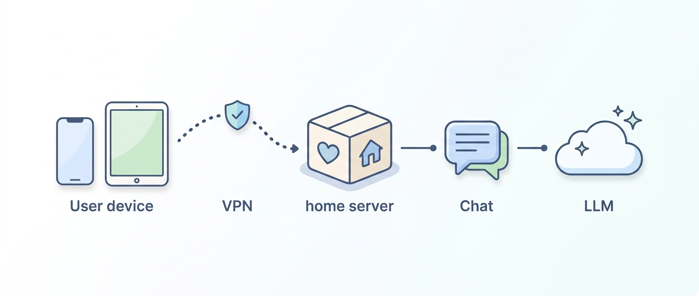
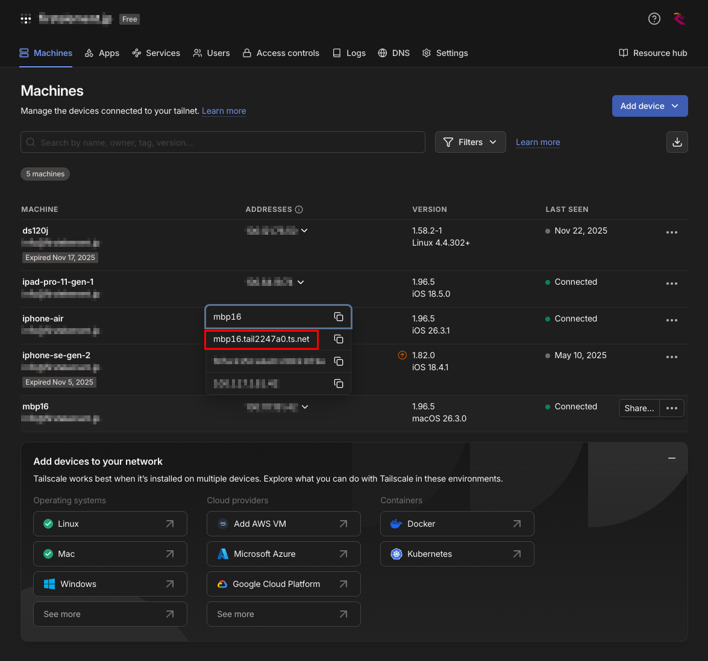

<p align="center">
  
</p>

# Home AI



A home AI assistant built with LangChain. **Primarily uses local LLMs** with OpenAI as an optional provider.

## Structure

```
.
├── chatbot.py        # CLI chatbot with multi-language support
├── web_chatbot.py    # Streamlit web interface
├── desktop_app.py    # PyQt6 desktop application
├── config_manager.py # Configuration file management
├── config_wizard.py  # Setup wizard for first-time configuration
├── auto_start.py     # Auto-start configuration for OS
├── prompts.py        # Multi-language prompt templates
├── requirements.txt  # Dependencies
├── .env.example      # Environment configuration
├── .gitignore
└── README.md
```

## Setup

### 1. Clone repository

```bash
git clone https://github.com/dxd5001/homeai.git
cd homeai
```

### 2. Create and activate virtual environment

```bash
python -m venv .venv
source .venv/bin/activate   # macOS / Linux
.venv\Scripts\activate      # Windows
```

### 3. Install dependencies

```bash
pip install -r requirements.txt
```

### 4. Set up environment variables

Copy `.env.example` to `.env` and configure it.

```bash
cp .env.example .env
```

**Note**: `.env` contains your actual API keys and settings, while `.env.example` is the template. The `.env` file is automatically excluded from Git by `.gitignore`.

Edit `.env`:

```bash
# Use local LLM (default)
USE_LOCAL_LLM=true
LOCAL_LLM_BASE_URL=http://127.0.0.1:1235/v1  # Change to your LM Studio port
LOCAL_LLM_MODEL=google/gemma-4-e4b  # Change to your actual model name

# Use OpenAI (optional)
# OPENAI_API_KEY=sk-xxxxxxxxxxxxxxxxxxxx
# USE_LOCAL_LLM=false
```

Home AI works with local LLM servers that provide an OpenAI-compatible API. Examples include:

| Server | Example base URL | Notes |
|---|---|---|
| LM Studio | `http://127.0.0.1:1235/v1` | Use the port shown in LM Studio server settings |
| Ollama | `http://127.0.0.1:11434/v1` | Use Ollama's OpenAI-compatible endpoint |
| llama.cpp | `http://127.0.0.1:8080/v1` | Start `llama-server` with OpenAI-compatible API support |
| vLLM | `http://127.0.0.1:8000/v1` | Start vLLM with its OpenAI-compatible API server |

Set `LOCAL_LLM_BASE_URL` to the server's `/v1` endpoint and `LOCAL_LLM_MODEL` to the model name recognized by that server.

### 5. Run

#### Web Launcher (Recommended)

The recommended way to run Home AI is the Web Launcher. It starts the Streamlit Web UI, opens the browser, and stays in the menu bar/tray so users can quit the Streamlit process easily.

```bash
source .venv/bin/activate   # macOS / Linux
# .venv\Scripts\activate      # Windows
python web_launcher.py
```

The launcher provides:
- Starts Streamlit on `http://localhost:8501`
- Opens the default browser automatically
- Menu bar/tray menu to reopen Home AI
- Start Tailscale Serve for port `8501`
- Stop Tailscale Serve
- Show Tailscale Serve status in `~/.homeai/logs/web_launcher.log`
- Tailscale Serve help link
- Quit menu that stops Streamlit

The launcher automatically looks for the Tailscale command in common locations. It prefers CLI launcher paths such as `/usr/local/bin/tailscale` and `/opt/homebrew/bin/tailscale`, then falls back to `/Applications/Tailscale.app/Contents/MacOS/Tailscale`, and finally checks `PATH`.

Launcher logs are stored at `~/.homeai/logs/web_launcher.log`. When the log exceeds 1MB, it is rotated to `web_launcher.log.1`.

**Note**: `Stop Tailscale Serve` runs `tailscale serve reset`, which may remove other Tailscale Serve settings on the machine.

#### Building Web Launcher

To create a standalone macOS launcher application bundle (.app):

```bash
# Install PyInstaller
pip install pyinstaller

# Build the launcher
pyinstaller --windowed --onedir --name "Home AI Launcher" web_launcher.py \
  --icon "static/homeai_logo.icns" \
  --add-data "web_chatbot.py:." \
  --add-data "prompts.py:." \
  --add-data "static/homeai_icon-8.png:static" \
  --add-data "static/homeai_logo@2x.png:static" \
  --add-data "static/homeai_logo-8.png:static" \
  --collect-all streamlit \
  --hidden-import "streamlit.web.cli"
```

The output will be in `dist/Home AI Launcher.app`.

**Customizing the build:**

You can create a `.spec` file for more control:

```bash
# Generate spec file
pyinstaller --windowed --onedir --name "Home AI Launcher" web_launcher.py

# Edit the generated .spec file to customize:
# - App name
# - Icon (requires .icns file)
# - Bundle identifier
# - Info.plist settings

# Rebuild with spec file
pyinstaller --noconfirm homeai.spec
```

**Installing the application:**

```bash
# Copy to Applications folder
cp -R dist/Home\ AI\ Launcher.app /Applications/

# Launch from Applications or dock
```

#### Native Desktop Application (Alternative)

Home AI also includes an alternative native PyQt desktop application. The Web Launcher is recommended for general use, but the native app can be useful as an experimental or fallback implementation.

```bash
source .venv/bin/activate   # macOS / Linux
# .venv\Scripts\activate      # Windows
python desktop_app.py
```

The native desktop application provides:
- System tray icon for easy access
- Setup wizard for first-time configuration
- Native PyQt chat window
- Settings menu for configuration changes

To build the native desktop application:

```bash
pyinstaller --windowed --onedir --name "Home AI" desktop_app.py
```

The output will be in `dist/Home AI.app`.

#### CLI Version

Activate virtual environment and run the chatbot:

```bash
source .venv/bin/activate   # macOS / Linux
# .venv\Scripts\activate      # Windows
python chatbot.py
```

#### Web UI Version

Activate virtual environment and run the Streamlit app:

```bash
source .venv/bin/activate   # macOS / Linux
# .venv\Scripts\activate      # Windows
streamlit run web_chatbot.py
```

The browser will automatically open at `http://localhost:8501`.

## Usage

```
==================================================
  HomeAI
  Type 'quit' or 'exit' to end
==================================================

You: Hello!
AI : Hello! How can I help you today?

You: What is LangChain?
AI : LangChain is a framework for building applications with large language models...

You: quit
Ending conversation. See you again!
```

## Code Structure

| Step | Class / Function | Role |
|---|---|---|
| 1 | `ChatOpenAI` / `ChatLocalAI` | LLM model initialization (local/OpenAI switching) |
| 2 | `ChatPromptTemplate` | System prompt + history template definition |
| 3 | `prompt \| model \| StrOutputParser()` | LCEL chain construction |
| 4 | `InMemoryChatMessageHistory` | In-memory conversation history management |
| 5 | `RunnableWithMessageHistory` | Add history management to chain |

---

## 🌐 Remote Access

When using local LLMs through an OpenAI-compatible API server such as LM Studio, Ollama, llama.cpp, or vLLM, you can access your HomeAI remotely from your smartphone using Tailscale Serve for private access within your Tailnet.

### Prerequisites

1. **Tailscale account**: Register at https://tailscale.com
2. **Tailscale client**: Install on home PC and smartphone
3. **Local LLM (LM Studio, Ollama, llama.cpp, vLLM, etc.)**: Running in OpenAI-compatible API server mode

### Setup Steps

#### 1. Start local LLM

**For LM Studio:**
1. Launch LM Studio
2. Enable server mode
3. Check port (default: 1234)

#### 2. Configure .env file

```bash
# Use local LLM (default settings)
USE_LOCAL_LLM=true
LOCAL_LLM_BASE_URL=http://127.0.0.1:1235/v1  # Change to your LM Studio port
LOCAL_LLM_MODEL=google/gemma-4-e4b  # Change to your actual model name

# Use OpenAI (optional)
# USE_LOCAL_LLM=false
# OPENAI_API_KEY=sk-xxxxxxxxxxxxxxxxxxxx
```

#### 3. Launch Streamlit app

```bash
source venv/bin/activate
streamlit run web_chatbot.py
```

#### 4. Expose with Tailscale Serve

**First, enable Tailscale CLI:**

**macOS:**
Add alias to `~/.zshrc`:
```bash
echo "alias tailscale='/Applications/Tailscale.app/Contents/MacOS/Tailscale'" >> ~/.zshrc
source ~/.zshrc
```

**Windows:**
Add Tailscale to PATH or use PowerShell:
```powershell
# Add to PATH (requires admin privileges)
$env:Path += ";C:\Program Files\Tailscale\"
# Or use full path directly
& "C:\Program Files\Tailscale\tailscale.exe" serve --bg 8501
```

**Then expose the app:**

```bash
tailscale serve --bg 8501
```

Now accessible at `https://your-tailnet-name.ts.net` within your Tailnet.



<div style='text-align: center; color: gray; font-size: 0.9em; margin: 10px 0;'>
    Click the Address of the machine running Home AI to see the FQDN
</div>

#### 5. Access from smartphone

1. Install Tailscale app on smartphone
2. Login with same account
3. Access Serve URL in browser

### Security

- **Private access**: Only Tailnet members can access (not publicly accessible)
- **HTTPS**: Serve automatically provides HTTPS with valid certificates
- **Authentication**: Tailscale authentication as first layer of security
- **Access control**: ACL (Access Control Lists) for fine-grained permissions

### Architecture

```
Smartphone (remote)
    ↓ Tailscale VPN
Tailscale Serve
    ↓ Private communication
Home PC
    ↓ localhost
Streamlit → Local LLM
```
